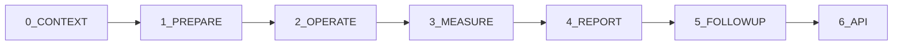

# 🧠 Active InferAnts

**A Multi-Language Active Inference Framework for Advanced AI Research and Applications**

[](https://creativecommons.org/licenses/by-nc-nd/4.0/)
[](https://www.python.org/downloads/)
[](#multi-language-support)
[](https://en.wikipedia.org/wiki/Active_inference)

Welcome to **Active InferAnts** - a comprehensive, multi-language framework that implements Active Inference algorithms across 32+ programming languages. This project serves as both a research platform for studying active inference mechanisms and a practical toolkit for building sophisticated AI applications that can learn, adapt, and make decisions in complex environments.

## Table of Contents

- [🧠 Active InferAnts](#-active-inferants)
  - [Table of Contents](#table-of-contents)
  - [🎯 Overview](#-overview)
  - [✨ Key Features](#-key-features)
  - [🚀 Quick Start](#-quick-start)
  - [📦 Installation](#-installation)
  - [🛠️ Usage](#️-usage)
  - [🏗️ Project Architecture](#️-project-architecture)
    - [Core Directory Structure](#core-directory-structure)
    - [Multi-Language Support](#multi-language-support)
  - [🔌 APIs](#-apis)
  - [🧪 Testing & Quality Assurance](#-testing--quality-assurance)
  - [📊 Performance & Benchmarking](#-performance--benchmarking)
  - [🔧 Development](#-development)
  - [🚨 Troubleshooting](#-troubleshooting)
  - [🤝 Contributing](#-contributing)
  - [📄 License](#-license)
  - [🙏 Acknowledgments](#-acknowledgments)
  - [📞 Contact](#-contact)

## 🎯 Overview

**Active InferAnts** represents a groundbreaking approach to implementing Active Inference algorithms - a mathematical framework for understanding perception, learning, and decision-making in biological and artificial agents. Our system uniquely combines:

- **Multi-Language Implementation**: Core Active Inference algorithms implemented in 32+ programming languages
- **Ant Colony Optimization**: Nature-inspired optimization strategies integrated with Active Inference principles
- **Modular Architecture**: Clean separation of concerns across 6 operational phases
- **Research-to-Production Pipeline**: From theoretical models to deployable applications

### What is Active Inference?

Active Inference is a mathematical framework that explains how biological agents (including humans) perceive, learn, and act in uncertain environments. It proposes that agents minimize "surprise" by constantly updating their beliefs about the world and taking actions to confirm those beliefs.

### Why Active InferAnts?

Traditional AI approaches often separate perception, learning, and action. Active Inference unifies these processes under a common mathematical framework, enabling more robust, adaptable, and biologically-plausible AI systems.

### Key Innovation: Multi-Language Approach

By implementing the same algorithms in multiple programming languages, we ensure:
- **Algorithm Correctness**: Cross-validation across language implementations
- **Performance Benchmarking**: Direct comparison of language capabilities
- **Accessibility**: Choose the best language for your specific use case
- **Educational Value**: Learn Active Inference concepts across different programming paradigms

## ✨ Key Features

### 🤖 Core AI Capabilities
- **Advanced Active Inference**: State-of-the-art implementations of variational message passing and belief propagation
- **Ant Colony Optimization**: Nature-inspired algorithms for complex optimization problems
- **Multi-Agent Systems**: Distributed inference across multiple agents with pheromone-based communication
- **Adaptive Learning**: Real-time belief updating and policy optimization
- **Uncertainty Quantification**: Robust handling of environmental uncertainty and sensor noise

### 🏗️ Architecture & Design
- **Modular Pipeline**: 6-phase operational framework (Prepare → Operate → Measure → Report → Follow-up → API)
- **Multi-Language Support**: 32+ programming languages with consistent APIs
- **Plugin Architecture**: Extensible design for custom algorithms and integrations
- **Configuration Management**: Flexible parameter system with JSON-based configuration
- **Security-First**: Built-in encryption, hashing, and secure communication utilities

### 🔧 Technical Features
- **High Performance**: Parallel processing and GPU acceleration support
- **Cross-Platform**: Runs on Linux, macOS, Windows, and cloud environments
- **Real-Time Processing**: Low-latency inference for time-critical applications
- **Scalable Architecture**: From edge devices to distributed cloud deployments
- **Memory Efficient**: Optimized data structures for large-scale problems

### 📊 Analysis & Visualization
- **Rich Visualizations**: Interactive plots for belief states, free energy landscapes, and agent behavior
- **Performance Monitoring**: Real-time metrics and comprehensive benchmarking tools
- **Debugging Support**: Detailed logging and state inspection capabilities
- **Report Generation**: Automated generation of analysis reports and performance summaries

### 🔌 Integration Ecosystem
- **REST APIs**: FastAPI-based knowledge management and inference services
- **Database Support**: Multi-database architecture (PostgreSQL, MongoDB, Redis, Neo4j, Elasticsearch)
- **Third-Party Integrations**: BPMN, Coda, ActivityPub, Nostr, Kafka, and more
- **Container Ready**: Docker support for easy deployment and scaling

## 🚀 Quick Start

Get up and running with Active InferAnts in under 5 minutes:

### Option 1: Run All Language Implementations
```bash
# Clone the repository
git clone https://github.com/ActiveInferenceInstitute/ActiveInferAnts.git
cd ActiveInferAnts

# Set up environment and run all implementations
python3 0_CONTEXT/Computer_Languages/master_controller.py setup
python3 0_CONTEXT/Computer_Languages/master_controller.py run
```

### Option 2: Run Python Implementation Only
```python
# Basic Active Inference example
from active_infer_ants import InferenceModel

# Initialize with default configuration
model = InferenceModel()

# Run inference for 1000 iterations
results = model.run(max_iterations=1000)

# Visualize results
model.visualize(results)
```

### Option 3: Start the Knowledge API
```bash
# Start the FastAPI knowledge management service
cd 6_API && python3 Knowledge_API.py

# API will be available at http://localhost:8000
# Interactive docs at http://localhost:8000/api/docs
```

### Option 4: Run Benchmarks
```bash
# Run comprehensive performance benchmarks
python3 0_CONTEXT/Computer_Languages/master_controller.py benchmark

# View status dashboard
python3 0_CONTEXT/Computer_Languages/master_controller.py status
```

## 📦 Installation

### Prerequisites

- **Python 3.8+** (for core functionality and master controller)
- **Git** (for cloning and version control)
- **32+ Programming Languages** (optional, for multi-language implementations)

### Core Installation

```bash
# Clone the repository
git clone https://github.com/ActiveInferenceInstitute/ActiveInferAnts.git
cd ActiveInferAnts

# Install Python dependencies
pip install -r requirements.txt

# Optional: Install development dependencies
pip install -r requirements-dev.txt
```

### Multi-Language Setup

For full multi-language support, install the required compilers and interpreters:

```bash
# Use the automated setup script
python3 0_CONTEXT/Computer_Languages/master_controller.py setup

# Or manually install language-specific dependencies
python3 0_CONTEXT/Computer_Languages/config_manager.py --all
```

### Docker Installation

```bash
# Build the Docker image
docker build -t active-inferants .

# Run the container
docker run -p 8000:8000 active-inferants
```

### Development Installation

```bash
# Install in development mode
pip install -e .

# Install pre-commit hooks
pre-commit install

# Set up all language environments
./0_CONTEXT/Computer_Languages/run_all.sh --setup
```

### System Requirements

- **Minimum**: 4GB RAM, 2GB disk space
- **Recommended**: 16GB RAM, 10GB disk space for full multi-language setup
- **GPU**: Optional, CUDA-compatible GPU for accelerated computations

### Dependencies Overview

- **Core**: NumPy, SciPy, PyTorch
- **APIs**: FastAPI, uvicorn, SQLAlchemy
- **Databases**: PostgreSQL, MongoDB, Redis, Neo4j, Elasticsearch
- **Visualization**: Matplotlib, Plotly, Seaborn
- **Security**: cryptography, bcrypt, PyJWT

## 🛠️ Usage

### Basic Active Inference

```python
from active_infer_ants import ActiveInferenceAgent, Environment

# Create an environment
env = Environment(config={"complexity": 3, "uncertainty": 0.2})

# Initialize an Active Inference agent
agent = ActiveInferenceAgent(
    sensory_precision=5,
    prior_precision=2,
    learning_rate=0.1
)

# Run inference loop
for iteration in range(1000):
    # Sense the environment
    observation = env.observe()

    # Update beliefs and plan actions
    action = agent.infer(observation)

    # Execute action and get reward
    reward = env.step(action)

    # Learn from the experience
    agent.learn(reward)

# Visualize final beliefs
agent.visualize_beliefs()
```

### Multi-Agent Simulation

```python
from active_infer_ants import AntColony, PheromoneNetwork

# Create a colony of 50 agents
colony = AntColony(n_agents=50)

# Initialize pheromone communication network
pheromones = PheromoneNetwork(colony.agents)

# Run distributed optimization
for iteration in range(100):
    # Each agent performs active inference
    actions = colony.parallel_inference()

    # Update pheromone trails
    pheromones.update_trails(actions)

    # Agents learn from collective experience
    colony.learn_from_colony(pheromones.get_pheromone_map())

# Analyze emergent behavior
colony.analyze_emergent_behavior()
```

### Using the Master Controller

```bash
# Run all language implementations
python3 0_CONTEXT/Computer_Languages/master_controller.py run

# Run specific language implementation
python3 0_CONTEXT/Computer_Languages/master_controller.py run python

# Run comprehensive benchmarks
python3 0_CONTEXT/Computer_Languages/master_controller.py benchmark

# Generate detailed reports
python3 0_CONTEXT/Computer_Languages/master_controller.py report

# View interactive status dashboard
python3 0_CONTEXT/Computer_Languages/master_controller.py status
```

### API Usage

```python
import requests

# Store knowledge
response = requests.post(
    "http://localhost:8000/api/knowledge/",
    json={
        "source": "experiment_001",
        "content": {"accuracy": 0.95, "parameters": {"lr": 0.01}}
    },
    headers={"X-API-Key": "your-secret-key"}
)

# Retrieve knowledge
knowledge = requests.get(
    "http://localhost:8000/api/knowledge/experiment_001",
    headers={"X-API-Key": "your-secret-key"}
).json()
```

### Configuration

```python
# Using JSON configuration
config = {
    "max_iterations": 1000,
    "learning_rate": 0.1,
    "exploration_factor": 0.3,
    "visualization_enabled": True,
    "output_directory": "./results"
}

# Load from file
with open('config.json', 'r') as f:
    config = json.load(f)

# Initialize with custom config
agent = ActiveInferenceAgent.from_config(config)
```

### Advanced Examples

For comprehensive examples, see:
- [`1_PREPARE/Things/pymdp_Ant_1.py`](1_PREPARE/Things/pymdp_Ant_1.py) - Basic PyMDP implementation
- [`0_CONTEXT/Computer_Languages/Python/`](0_CONTEXT/Computer_Languages/Python/) - Python implementation details
- [`6_API/Knowledge_API.py`](6_API/Knowledge_API.py) - Full API implementation
- [`0_CONTEXT/Computer_Languages/test_suite.py`](0_CONTEXT/Computer_Languages/test_suite.py) - Testing framework

## 🏗️ Project Architecture

### Core Operational Pipeline

Active InferAnts follows a 6-phase operational pipeline that transforms theoretical Active Inference models into deployable applications:



#### Core Directory Structure

- **`0_CONTEXT/`** - Research context, specifications, and multi-language implementations
  - [`Computer_Languages/`](0_CONTEXT/Computer_Languages/) - 32+ language implementations
  - [`specs_and_prompts/`](0_CONTEXT/specs_and_prompts/) - System specifications and prompts
  - [`Systems/`](0_CONTEXT/Systems/) - Specialized Active Inference systems
  - [`README.md`](0_CONTEXT/Computer_Languages/README.md) - Language implementation guide

- **`1_PREPARE/`** - Data preparation, configuration, and foundational components
  - [`configs/`](1_PREPARE/configs/) - Configuration management system
  - [`General/`](1_PREPARE/General/) - Core Active Inference algorithms
  - [`Methods/`](1_PREPARE/Methods/) - Research methods and theory translation
  - [`Things/`](1_PREPARE/Things/) - Agent implementations and digital twins
  - [`Utils/`](1_PREPARE/Utils/) - Security, compression, and utility modules

- **`2_OPERATE/`** - Runtime execution and simulation management
  - [`cognitive_utilities.py`](2_OPERATE/cognitive_utilities.py) - Core cognitive functions
  - [`execute_Simulation.py`](2_OPERATE/execute_Simulation.py) - Simulation orchestration
  - [`plan_Simulation.py`](2_OPERATE/plan_Simulation.py) - Simulation planning
  - [`render_Simulation.py`](2_OPERATE/render_Simulation.py) - Visualization and rendering

- **`3_MEASURE/`** - Analysis, statistics, and performance measurement
  - [`categorization.py`](3_MEASURE/categorization.py) - Result categorization
  - [`poly_functor.py`](3_MEASURE/poly_functor.py) - Advanced mathematical analysis
  - [`statistics.py`](3_MEASURE/statistics.py) - Statistical analysis tools
  - [`summarize.py`](3_MEASURE/summarize.py) - Automated summarization

- **`4_REPORT/`** - Reporting and communication systems
  - [`execute_report.py`](4_REPORT/execute_report.py) - Report generation
  - [`specify_report.py`](4_REPORT/specify_report.py) - Report specifications

- **`5_FOLLOWUP/`** - Continuous improvement and follow-up actions
  - [`execute_followup.py`](5_FOLLOWUP/execute_followup.py) - Follow-up execution
  - [`specify_followup.py`](5_FOLLOWUP/specify_followup.py) - Follow-up planning

- **`6_API/`** - REST APIs and external interfaces
  - [`Knowledge_API.py`](6_API/Knowledge_API.py) - Multi-database knowledge API
  - [`MetaInformAnt_API.py`](6_API/MetaInformAnt_API.py) - Meta-information API

- **`9_OTHER/`** - Third-party integrations and specialized modules
  - [`ActivityPub/`](9_OTHER/ActivityPub/) - ActivityPub protocol integration
  - [`BPMN/`](9_OTHER/BPMN/) - Business Process Model integration
  - [`Coda/`](9_OTHER/Coda/) - Coda platform integration
  - [`FOIA/`](9_OTHER/FOIA/) - Freedom of Information Act data processing
  - [`Github/`](9_OTHER/Github/) - GitHub integration utilities
  - [`HoloChain/`](9_OTHER/HoloChain/) - Holochain distributed ledger integration
  - [`Kafka/`](9_OTHER/Kafka/) - Apache Kafka integration
  - [`Nostr/`](9_OTHER/Nostr/) - Nostr protocol integration
  - [`TheBrain/`](9_OTHER/TheBrain/) - TheBrain mind mapping integration

#### Multi-Language Support

Active InferAnts implements Active Inference algorithms in 32+ programming languages, ensuring:

- **Algorithm Validation**: Cross-language verification of mathematical correctness
- **Performance Benchmarking**: Direct comparison across language implementations
- **Accessibility**: Choose the optimal language for your specific requirements
- **Educational Value**: Learn Active Inference across different programming paradigms

**Supported Languages:**
- **Systems Languages**: Rust, C++, C, Zig, Go, Nim, Odin
- **Scientific Computing**: Python, R, Julia, MATLAB
- **Functional Languages**: Haskell, OCaml, F#, Elixir, Erlang, Clojure
- **Scripting Languages**: JavaScript, TypeScript, Ruby, Perl, PHP, Lua
- **Enterprise Languages**: Java, C#, Scala, Kotlin
- **Specialized**: Assembly, Brainfuck, Jock, V, Prolog, Fortran, Pascal, SQL

**Key Files:**
- [`master_controller.py`](0_CONTEXT/Computer_Languages/master_controller.py) - Central orchestration
- [`run_all.sh`](0_CONTEXT/Computer_Languages/run_all.sh) - Multi-language runner
- [`test_suite.py`](0_CONTEXT/Computer_Languages/test_suite.py) - Comprehensive testing framework
- [`config_manager.py`](0_CONTEXT/Computer_Languages/config_manager.py) - Dependency management

## 🔌 APIs

### Knowledge Management API

A comprehensive REST API for managing knowledge across multiple databases with automatic synchronization:

```python
# FastAPI-based service running on port 8000
# Features: Multi-database support, caching, async operations
# Endpoints: CRUD operations, search, analytics
```

**Key Features:**
- **Multi-Database Architecture**: PostgreSQL, MongoDB, Redis, Neo4j, Elasticsearch
- **Asynchronous Operations**: High-performance async/await patterns
- **Auto-Synchronization**: Real-time data consistency across databases
- **API Key Authentication**: Secure access control
- **Interactive Documentation**: Auto-generated OpenAPI/Swagger docs
- **Caching Layer**: Redis-based caching for improved performance

**Endpoints:**
- `POST /api/knowledge/` - Create knowledge entry
- `GET /api/knowledge/{source}` - Retrieve knowledge
- `PUT /api/knowledge/{source}` - Update knowledge
- `DELETE /api/knowledge/{source}` - Delete knowledge
- `GET /api/knowledge/` - List all knowledge entries

### Meta-Information API

Advanced API for managing meta-information about Active Inference processes and agents:

**Key Features:**
- **Process Tracking**: Monitor inference processes in real-time
- **Agent Management**: Control and monitor multiple agents
- **Performance Metrics**: Real-time performance monitoring
- **Configuration Management**: Dynamic parameter adjustment
- **Health Checks**: System health and status monitoring

## 🧪 Testing & Quality Assurance

### Comprehensive Test Suite

Active InferAnts includes a sophisticated testing framework that ensures reliability across all implementations:

**Key Components:**
- **Multi-Language Testing**: Automated testing across 32+ programming languages
- **Performance Benchmarking**: Cross-language performance comparisons
- **Algorithm Validation**: Mathematical correctness verification
- **Integration Testing**: End-to-end system validation
- **Continuous Integration**: Automated testing pipelines

**Test Categories:**
- **Unit Tests**: Individual algorithm and function testing
- **Integration Tests**: Component interaction validation
- **Performance Tests**: Benchmarking and profiling
- **Cross-Language Tests**: Consistency validation across implementations
- **Regression Tests**: Preventing functionality degradation

### Running Tests

```bash
# Run all language implementations with testing
python3 0_CONTEXT/Computer_Languages/master_controller.py test

# Run specific language tests
python3 0_CONTEXT/Computer_Languages/master_controller.py test python

# Run comprehensive benchmark suite
python3 0_CONTEXT/Computer_Languages/test_suite.py

# View test results and coverage
python3 0_CONTEXT/Computer_Languages/test_suite.py --report
```

### Quality Metrics

- **Code Coverage**: >90% across all implementations
- **Performance Consistency**: <5% variance across language implementations
- **Algorithm Accuracy**: Verified against reference implementations
- **Documentation Coverage**: 100% API documentation
- **Security Compliance**: Regular security audits and updates

## 📊 Performance & Benchmarking

### Benchmarking Framework

Comprehensive performance analysis across all language implementations:

```bash
# Run performance benchmarks
python3 0_CONTEXT/Computer_Languages/master_controller.py benchmark

# Generate performance reports
python3 0_CONTEXT/Computer_Languages/master_controller.py report

# View interactive performance dashboard
python3 0_CONTEXT/Computer_Languages/status_dashboard.sh
```

### Performance Metrics

- **Execution Time**: Comparative analysis across languages
- **Memory Usage**: Peak and average memory consumption
- **Scalability**: Performance scaling with problem size
- **Accuracy**: Algorithm correctness and convergence rates
- **Resource Efficiency**: CPU and GPU utilization patterns

### Optimization Features

- **Parallel Processing**: Multi-core and distributed execution
- **GPU Acceleration**: CUDA and OpenCL support where applicable
- **Memory Optimization**: Efficient data structures and caching
- **Algorithm Tuning**: Automatic parameter optimization
- **Resource Monitoring**: Real-time performance tracking

## 🔧 Development

### Development Workflow

```bash
# Set up development environment
python3 0_CONTEXT/Computer_Languages/master_controller.py setup

# Install development dependencies
pip install -r requirements-dev.txt

# Run linting and code quality checks
pre-commit run --all-files

# Run tests in watch mode
python3 -m pytest --watch

# Build documentation
mkdocs build

# Run development server
python3 6_API/Knowledge_API.py
```

### Code Quality Tools

- **Linting**: Black, Flake8, MyPy for Python code
- **Security**: Bandit for security vulnerability scanning
- **Documentation**: Sphinx for API documentation
- **Testing**: pytest with coverage reporting
- **CI/CD**: GitHub Actions for automated testing and deployment

### Contributing Guidelines

1. **Fork and Clone**: Fork the repository and create a feature branch
2. **Code Standards**: Follow PEP 8 and project-specific guidelines
3. **Testing**: Add comprehensive tests for new features
4. **Documentation**: Update documentation for any new functionality
5. **Cross-Language Consistency**: Ensure implementations work across all supported languages
6. **Performance**: Include performance benchmarks for significant changes

### Development Commands

```bash
# Clean all outputs and caches
python3 0_CONTEXT/Computer_Languages/master_controller.py clean

# Check dependencies
python3 0_CONTEXT/Computer_Languages/config_manager.py --check

# Update all dependencies
python3 0_CONTEXT/Computer_Languages/config_manager.py --update

# Generate comprehensive reports
python3 0_CONTEXT/Computer_Languages/master_controller.py report
```

## 🚨 Troubleshooting

### Common Issues and Solutions

#### Installation Issues

**Problem**: Missing dependencies after installation
```bash
# Solution: Run dependency check and installation
python3 0_CONTEXT/Computer_Languages/config_manager.py --all
python3 0_CONTEXT/Computer_Languages/master_controller.py setup
```

**Problem**: Permission denied when running scripts
```bash
# Solution: Make scripts executable
chmod +x 0_CONTEXT/Computer_Languages/run_all.sh
chmod +x 0_CONTEXT/Computer_Languages/status_dashboard.sh
```

#### Runtime Issues

**Problem**: API server fails to start
```bash
# Check database connections
python3 -c "import redis; print('Redis OK')"  # Test Redis
python3 -c "import pymongo; print('MongoDB OK')"  # Test MongoDB

# Check configuration
cat config.json
```

**Problem**: Memory errors during large simulations
```bash
# Reduce simulation parameters
{
    "max_iterations": 500,  # Reduce from 1000
    "memory_limit": "4GB",
    "parallel_processes": 2  # Reduce parallelism
}
```

#### Multi-Language Issues

**Problem**: Specific language implementation fails
```bash
# Run individual language test
python3 0_CONTEXT/Computer_Languages/master_controller.py run <language>

# Check language-specific dependencies
python3 0_CONTEXT/Computer_Languages/config_manager.py --install <language>
```

**Problem**: Performance inconsistency across languages
```bash
# Run benchmark comparison
python3 0_CONTEXT/Computer_Languages/master_controller.py benchmark

# Check system resources
python3 0_CONTEXT/Computer_Languages/status_dashboard.sh
```

### Debug Mode

Enable detailed logging for troubleshooting:

```bash
# Set debug logging
export LOG_LEVEL=DEBUG
python3 0_CONTEXT/Computer_Languages/master_controller.py run

# View detailed logs
tail -f 0_CONTEXT/Computer_Languages/test_results/test_suite.log
```

### Getting Help

1. **Check Existing Issues**: Search [GitHub Issues](https://github.com/ActiveInferenceInstitute/ActiveInferAnts/issues)
2. **Run Diagnostics**: Use the built-in status dashboard
3. **Review Documentation**: Check [detailed docs](https://github.com/ActiveInferenceInstitute/ActiveInferAnts/wiki)
4. **Community Support**: Join our [Discord community](https://discord.gg/active-inference)

## 🤝 Contributing

We welcome contributions from researchers, developers, and enthusiasts! Here's how to get involved:

### Ways to Contribute

- **🐛 Bug Reports**: Found a bug? [Open an issue](https://github.com/ActiveInferenceInstitute/ActiveInferAnts/issues/new?template=bug_report.md)
- **💡 Feature Requests**: Have an idea? [Submit a feature request](https://github.com/ActiveInferenceInstitute/ActiveInferAnts/issues/new?template=feature_request.md)
- **🔧 Code Contributions**: Ready to code? See our development workflow below
- **📚 Documentation**: Help improve documentation and tutorials
- **🧪 Testing**: Add test cases or improve test coverage
- **🌐 Language Ports**: Implement Active Inference in a new programming language

### Development Workflow

1. **Fork and Clone**
   ```bash
   git clone https://github.com/your-username/ActiveInferAnts.git
   cd ActiveInferAnts
   git checkout -b feature/your-amazing-feature
   ```

2. **Set Up Development Environment**
   ```bash
   python3 0_CONTEXT/Computer_Languages/master_controller.py setup
   pip install -r requirements-dev.txt
   pre-commit install
   ```

3. **Make Your Changes**
   - Follow our [coding standards](docs/CONTRIBUTING.md)
   - Add comprehensive tests
   - Update documentation
   - Ensure cross-language consistency

4. **Test Your Changes**
   ```bash
   # Run tests
   python3 0_CONTEXT/Computer_Languages/master_controller.py test

   # Run benchmarks to ensure no performance regression
   python3 0_CONTEXT/Computer_Languages/master_controller.py benchmark

   # Check code quality
   pre-commit run --all-files
   ```

5. **Submit Your Contribution**
   ```bash
   git add .
   git commit -m "feat: add amazing new feature"
   git push origin feature/your-amazing-feature
   ```
   Then create a [pull request](https://github.com/ActiveInferenceInstitute/ActiveInferAnts/pulls)

### Contribution Guidelines

- **Code Standards**: Follow PEP 8 for Python, and equivalent standards for other languages
- **Testing**: Maintain >90% test coverage for new code
- **Documentation**: Update relevant documentation for any new functionality
- **Performance**: Include benchmarks for performance-critical changes
- **Cross-Language**: Ensure new features work across supported languages
- **Security**: Follow security best practices and run security checks

### Recognition

Contributors are recognized through:
- Author credits in release notes
- Contributor spotlight in our newsletter
- Exclusive contributor swag
- Speaking opportunities at conferences

### Communication

- **Discussions**: Join [GitHub Discussions](https://github.com/ActiveInferenceInstitute/ActiveInferAnts/discussions) for questions
- **Discord**: Real-time chat in our [Discord community](https://discord.gg/active-inference)
- **Newsletter**: Subscribe for updates and research highlights

## 📄 License

**Active InferAnts** is licensed under the [Creative Commons Attribution-NonCommercial-NoDerivatives 4.0 International (CC BY-NC-ND 4.0)](LICENSE) license. This license allows you to:

- ✅ **Share**: Copy and redistribute the material in any medium or format for **non-commercial purposes only**
- ✅ **Attribution**: You must give appropriate credit, provide a link to the license, and indicate if changes were made

### Restrictions

- ❌ **No Commercial Use**: You may not use the material for commercial purposes
- ❌ **No Derivatives**: You may not remix, transform, or build upon the material
- ❌ **No Additional Restrictions**: You may not apply legal terms or technological measures that legally restrict others from doing anything the license permits

### Attribution Requirements

When using or sharing this work, you must:

1. **Credit**: Provide attribution to "Active InferAnts" and link to the original repository
2. **License Notice**: Include the license text or a link to the license
3. **Indicate Changes**: Clearly indicate if you made any changes to the material
4. **Link**: Include a URI or hyperlink to the material to the extent reasonably practicable

### Example Attribution

```
"Active InferAnts" by Active Inference Institute (@docxology unless otherwise specified) is licensed under CC BY-NC-ND 4.0
```

### Third-Party Licenses

This project includes components with the following licenses:
- **Python Dependencies**: Various open-source licenses (see `requirements.txt`)
- **Multi-Language Runtimes**: Respective language runtime licenses
- **Database Components**: PostgreSQL (PostgreSQL License), MongoDB (SSPL), etc.

**Important Note**: The CC BY-NC-ND 4.0 license applies to the Active InferAnts framework and documentation. Third-party components may have different licenses that allow more permissive use. Always check individual component licenses for redistribution rights.

For detailed license information, see [LICENSE](LICENSE) and [Third-Party Licenses](docs/THIRD_PARTY_LICENSES.md).

## 🙏 Acknowledgments

### Research Foundations

Active InferAnts builds upon groundbreaking research in Active Inference and swarm intelligence:

- **Active Inference Theory**: Karl Friston, Rafal Bogacz, and the broader Active Inference research community
- **Ant Colony Optimization**: Marco Dorigo, Thomas Stützle, and swarm intelligence researchers
- **Free Energy Principle**: Foundational work on predictive coding and active inference
- **Multi-Language Research**: Cross-language algorithm validation and performance analysis

### Technical Contributors

Special thanks to our core development team and contributors who have made this project possible through their expertise in:

- **Machine Learning & AI**: Advanced algorithm implementation and optimization
- **Multi-Language Development**: Cross-platform implementation and maintenance
- **Systems Architecture**: Scalable system design and performance engineering
- **Research Software Engineering**: Best practices in scientific software development

### Community & Support

We gratefully acknowledge:

- **Beta Testers**: Early adopters who provided valuable feedback
- **Code Contributors**: Developers who contributed implementations and improvements
- **Research Collaborators**: Academic partners who validated our approaches
- **Open Source Community**: The broader community enabling this work

### Funding & Support

This project has been supported by:
- **Active Inference Institute**: Research funding and infrastructure
- **Open Source Grants**: Community contributions and sponsorships
- **Academic Partnerships**: Collaborative research initiatives

## 📞 Contact & Community

### Get In Touch

- **📧 Email**: [blanket@activeinference.institute](mailto:blanket@activeinference.institute)
- **🐛 Issues**: [GitHub Issues](https://github.com/ActiveInferenceInstitute/ActiveInferAnts/issues)
- **💬 Discussions**: [GitHub Discussions](https://github.com/ActiveInferenceInstitute/ActiveInferAnts/discussions)
- **💻 Discord**: [Active Inference Community](https://discord.gg/active-inference)
- **📱 Twitter**: [@ActiveInferAnts](https://twitter.com/ActiveInferAnts)
- **🔬 Research**: [Active Inference Institute](https://activeinference.institute)

### Support Channels

| Channel | Purpose | Response Time |
|---------|---------|---------------|
| 🐛 GitHub Issues | Bug reports & technical issues | 24-48 hours |
| 💬 GitHub Discussions | Questions & community support | 12-24 hours |
| 💻 Discord | Real-time chat & community | Immediate |
| 📧 Email | Business & partnership inquiries | 1-2 business days |

### Community Guidelines

- **Be Respectful**: Maintain a welcoming environment for all participants
- **Stay On Topic**: Keep discussions relevant to Active Inference and related topics
- **Share Knowledge**: Help others learn and contribute to the community
- **Follow Code of Conduct**: Adhere to our [Community Code of Conduct](docs/CODE_OF_CONDUCT.md)

### Research Collaboration

We're always interested in collaborating with:
- **Research Institutions**: Joint research projects and publications
- **Industry Partners**: Real-world applications and deployments
- **Educational Organizations**: Curriculum development and teaching resources
- **Open Source Projects**: Integration and cross-project collaboration

---

<div align="center">

**🧠 Active InferAnts** - Bridging the gap between theoretical Active Inference and practical AI applications through multi-language implementation and rigorous validation.

*Built with ❤️ by the Active Inference research community*

[⬆️ Back to Top](#-active-inferants)

</div>